# Hướng dẫn sử dụng SecJIT Scan (GUI) — cho người dùng cuối

> Tài liệu này dành cho người **không cần biết Python**. Bạn chỉ cần Windows 10/11, Docker Desktop và file
> `secjit-scan.exe`. Mọi thao tác trên giao diện đều tương đương **một lệnh dòng lệnh** (mục 10) nên kết quả
> có thể chạy lại y hệt trên máy khác. Ảnh minh hoạ trong `docs/img/` chụp từ bản thử nghiệm (một số màn chụp ở chế
> độ dữ liệu mẫu, con số chỉ để minh hoạ).

**Mục lục:** 1. Công cụ làm gì · 2. Cài đặt · 3. Lần chạy đầu (Kiểm tra môi trường) · 4. Trang chủ · 5. Scan mới
(5 bước) · 6. Bảng điều khiển · 7. Kết quả · 8. Kiểm tay GOLD · 9. Cài đặt & Dọn dẹp · 10. Lệnh tương đương & tái lập ·
11. Sự cố thường gặp

---

## 1. Công cụ làm gì (1 phút)

Bạn đưa vào **một link GitHub** (dự án Java/Maven). Công cụ đi qua từng commit trong phạm vi bạn chọn, chạy nhiều
công cụ quét bảo mật (SAST) trong Docker, rồi **bỏ phiếu**: cùng một chỗ trong code được bao nhiêu công cụ *độc lập*
báo cùng loại lỗi (CWE). Kết quả là một bộ dữ liệu có nhãn:

| Nhãn | Nghĩa | Lưu ý |
|---|---|---|
| **gold · đồng thuận máy** | ≥ 2 công cụ *đắt* (phải build Maven) cùng báo, hoặc 1 đắt + 1 rẻ | **Chưa phải chân lý** — chỉ là "nhiều nguồn độc lập đồng ý". Thành *gold thật* khi người kiểm tay xác nhận (mục 8). |
| **silver** | 1 công cụ đắt, hoặc ≥ 2 công cụ rẻ | nhãn yếu, dùng có kiểm soát |
| **candidate** | 1 công cụ rẻ | tín hiệu gợi ý |
| **verified-clean** | commit sạch ở tầng rẻ **và** ≥ 2 công cụ đắt chạy xong vẫn không thấy lỗi mới | mẫu âm tin cậy hơn; vẫn không phải "chứng minh sạch" |
| **cheap-clean** | chỉ tầng rẻ không báo | mẫu âm yếu |

Hai "tầng" công cụ:
- **Tầng rẻ** (gitleaks, trufflehog, semgrep, bearer, horusec): quét ngay trên phần code thay đổi, không cần build —
  nhanh (~10–20 giây/commit).
- **Tầng đắt** (FindSecBugs, SonarQube, tuỳ chọn CodeQL): phải **build Maven** từng commit rồi mới phân tích — chậm
  (0,5–15 phút/commit), chỉ chạy trên commit "đáng nghi" và commit sạch cần xác minh.

---

## 2. Cài đặt

### 2.1 Yêu cầu máy
| Hạng mục | Tối thiểu | Khuyến nghị |
|---|---|---|
| Hệ điều hành | Windows 10 64-bit (bản 2004+) / Windows 11 | Windows 11 |
| RAM máy | 16 GB | **≥ 24 GB** (CodeQL cần RAM Docker ≥ 16 GB) |
| RAM cấp cho Docker | 6 GB | **≥ 14 GB** cho tầng đắt 2 luồng |
| Đĩa trống | 20 GB | ≥ 60 GB trên **SSD** (image Docker ~6 GB, clone + cache build 2–4 GB, kết quả 1–2 GB/repo) |
| Mạng | tải image lần đầu ~6 GB | — |

### 2.2 Các bước
1. **Bật WSL2** (Windows Subsystem for Linux 2): mở PowerShell *với quyền Administrator*, gõ `wsl --install`, khởi
   động lại máy.
2. **Cài Docker Desktop** (https://www.docker.com/products/docker-desktop/), chọn backend **WSL 2**. Mở Docker
   Desktop một lần để nó khởi tạo xong (biểu tượng cá voi ở khay hệ thống không còn "starting").
3. **Cấp RAM cho Docker**: WSL2 mặc định chỉ lấy 50 % RAM máy. Tạo/sửa file `C:\Users\<bạn>\.wslconfig`:
   ```
   [wsl2]
   memory=14GB
   processors=6
   ```
   rồi chạy `wsl --shutdown` và mở lại Docker Desktop. (Màn Kiểm tra môi trường sẽ đọc đúng số RAM Docker.)
4. **Cài Git** (https://git-scm.com/download/win) — công cụ dùng Git để đọc lịch sử commit. Nếu quên, màn Kiểm tra
   môi trường sẽ báo *Chặn* kèm lệnh `winget install Git.Git`.
5. **Tải `secjit-scan.exe`** (một file duy nhất: vừa là giao diện vừa là dòng lệnh — mục 10) từ trang phát
   hành của dự án, để vào một thư mục ngắn không dấu, ví dụ `D:\secjit\`. Không cần cài Python.
6. Nhấp đúp `secjit-scan.exe`. Một cửa sổ console nhỏ hiện cùng cửa sổ app: đó là **server backend**, giữ nguyên, đóng nó là tắt app. Lần đầu Windows SmartScreen có thể hỏi — chọn *More info → Run anyway*. Cửa sổ ứng
   dụng mở ra (nếu máy thiếu WebView2, ứng dụng tự mở trong trình duyệt mặc định).

> Thư mục dữ liệu của ứng dụng (danh sách run, profile, tốc độ đo): `%LOCALAPPDATA%\secjit\`. Kết quả quét để ở
> thư mục bạn chọn ở bước 4 của wizard (mặc định `D:\secjit\results`).

---

## 3. Lần chạy đầu — Kiểm tra môi trường (Preflight)

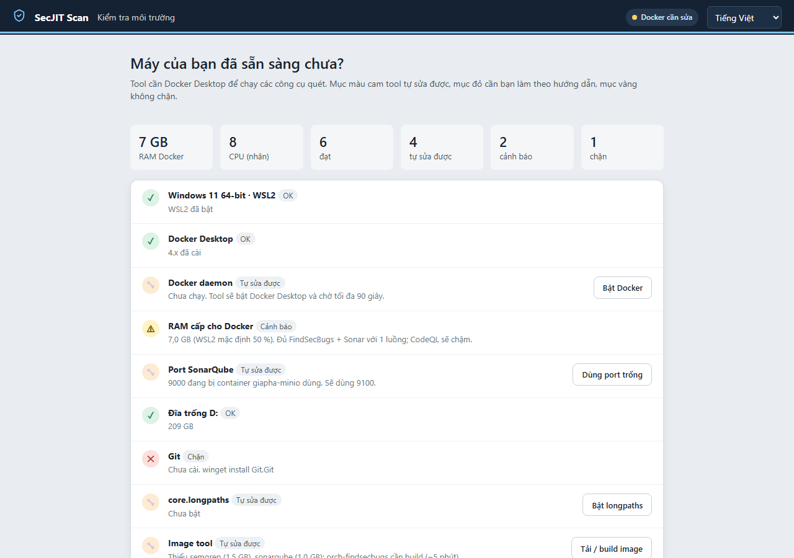

Mỗi lần mở, ứng dụng kiểm **13 mục** trước khi cho bạn chạy: Windows/WSL2 · Docker Desktop đã cài · Docker daemon
đang chạy · RAM cấp cho Docker · port SonarQube (9000) có trống · đĩa trống · Git · `core.longpaths` · image Docker
(5 tầng rẻ, maven, sonarqube, orch-findsecbugs cần *build* ~5 phút, codeql tuỳ chọn) · image có bị `:latest` · tham số
`vm.max_map_count` cho SonarQube · mạng tới github.com và Docker Hub · WebView2.

**Ba mức** (thẻ cạnh mỗi mục):
| Mức | Màu | Nghĩa | Bạn cần làm gì |
|---|---|---|---|
| **OK** | xanh ✓ | đạt | không |
| **Tự sửa được** | cam 🔧 | ứng dụng sửa được (bật Docker, chọn port trống, bật longpaths, tải/build image) | bấm nút ở dòng đó hoặc **Sửa tất cả tự động** |
| **Cảnh báo** | vàng ⚠ | chạy được nhưng chậm/thiếu (RAM Docker < 14 GB, image `:latest`, `max_map_count` thấp) | nên sửa theo hướng dẫn trong dòng; có thể **Tiếp tục dù còn ⚠** |
| **Chặn** | đỏ ✗ | không chạy được (thiếu Git, không có WSL2…) | làm theo hướng dẫn rồi **Kiểm tra lại** |

- **Sửa tất cả tự động** chạy lần lượt các mục cam, hiện tiến độ `Đang sửa i/n…`. Bật Docker có thể mất tới 90 giây.
- **Xem JSON chẩn đoán**: bản sao toàn bộ kết quả kiểm để gửi cho người hỗ trợ.
- Còn mục *Chặn* thì nút Tiếp tục bị khoá (có "Bỏ qua kiểm tra" nhưng không khuyến nghị).

---

## 4. Trang chủ

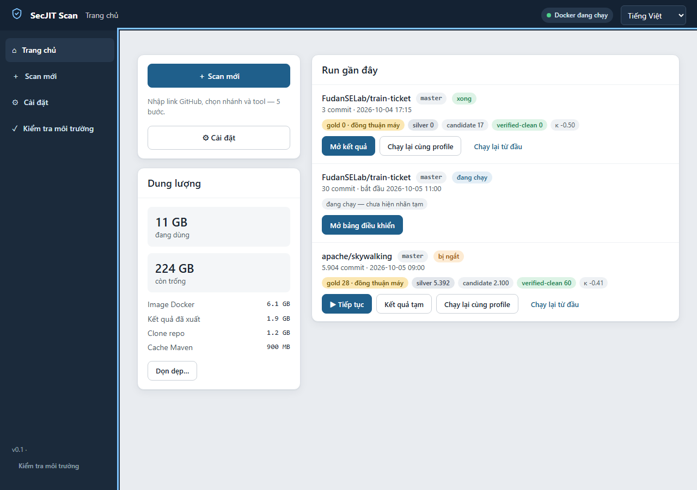

- **Scan mới** → mở wizard 5 bước (mục 5).
- **Dung lượng**: tổng dung lượng công cụ đang dùng (image Docker, kết quả, clone, cache Maven) và nút **Dọn dẹp…**
  (mục 9.2).
- **Run gần đây**: mỗi run một thẻ gồm repo/nhánh, trạng thái (`xong`, `đang chạy`, `bị ngắt`, `đã dừng`, `lỗi`),
  số commit, thời gian, và tóm tắt nhãn (`gold 0 · đồng thuận máy`, `silver`, `candidate`, `verified-clean`, κ).
  - **Mở kết quả** / **Mở bảng điều khiển** (run đang chạy).
  - **Tiếp tục** (run *bị ngắt*: máy tắt, Docker sập…) — chạy tiếp từ pha đang dở, **không mất** phần đã quét.
  - **Chạy lại cùng profile** — nạp y nguyên cấu hình cũ, chỉ đổi tên DB/export theo ngày hôm nay (dùng cho kiểm tra
    tái lập A/B, mục 10). **Chạy lại từ đầu** — đi lại wizard.
- Góc trên phải: trạng thái Docker (`Docker đang chạy` / `Docker tắt` — bấm để kiểm lại) và chọn ngôn ngữ.
- Khi Docker tắt bạn **vẫn xem được kết quả cũ**, nhưng không bắt đầu hay tiếp tục run được.

---

## 5. Scan mới — wizard 5 bước

### Bước 1 · Repo

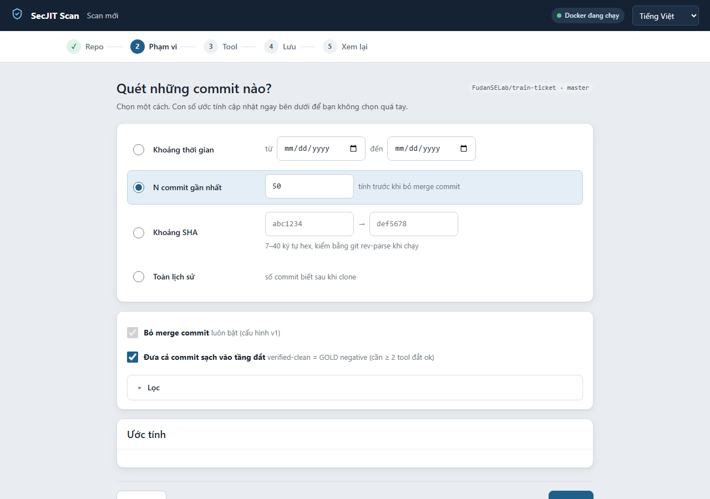

- Dán **link GitHub** (chấp nhận cả link có `/tree/…`, `/commit/…`, `.git`, dạng SSH — ứng dụng tự chuẩn hoá và
  hiện "Sẽ dùng: …"). MVP chỉ hỗ trợ github.com.
- Bấm **Kiểm tra**: ứng dụng đọc danh sách nhánh/tag và `pom.xml` **không cần clone** (5–30 giây). Bạn thấy: Public/
  Private, số nhánh/tag, nhánh mặc định, có Java/Maven không, JDK khai báo, số module, cảnh báo dependency
  `*-SNAPSHOT` (build tầng đắt dễ thất bại), số file cấu hình bảo mật.
- **Nhánh**: mỗi nhánh ra một bộ dữ liệu riêng. Một số repo không có `main/master` (ví dụ `trunk`) — ứng dụng sẽ nhắc.
- **Repo private**: tick và dán Personal Access Token; PAT chỉ giữ trong phiên, **không** ghi vào profile hay kết quả.
- Repo **không phải Java/Maven**: tầng đắt không chạy được; ứng dụng đề nghị *Tắt tầng đắt* (chỉ còn tầng rẻ, không có
  verified-clean).

### Bước 2 · Phạm vi

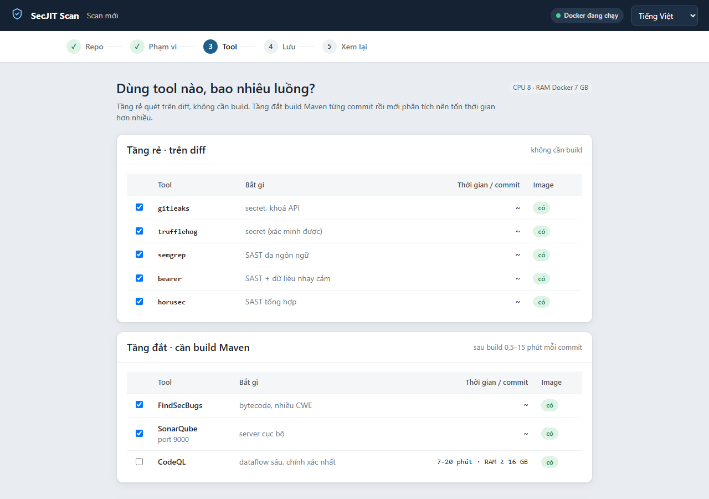

Chọn **một** cách lấy commit:
| Lựa chọn | Dùng khi | Ghi chú |
|---|---|---|
| **Khoảng thời gian** (từ … đến) | muốn một giai đoạn lịch sử | theo ngày commit |
| **N commit gần nhất** | chạy thử / nghiệm thu | đếm *trước* khi bỏ merge commit; **nên bắt đầu với 3 rồi 30** |
| **Khoảng SHA** | so sánh hai mốc phát hành | 7–40 ký tự hex |
| **Toàn lịch sử** | xây dataset đầy đủ | có thể nhiều giờ/ngày; xem ước tính |

- **Bỏ merge commit**: luôn bật (cấu hình v1).
- **Đưa cả commit sạch vào tầng đắt**: cần để có mẫu âm **verified-clean** (≥ 2 công cụ đắt chạy xong). Tốn thêm thời
  gian build; mục *Lọc* cho phép giới hạn *số commit sạch mỗi commit buggy*.
- **Chỉ giữ finding nằm trong diff của commit** (`in_diff=1`, mặc định bật): chỉ tính lỗi do *chính commit này* đưa vào,
  bỏ "nợ cũ" công cụ đắt phơi ra khi quét cả file.
- Khung **Ước tính** cập nhật theo lựa chọn: số commit sau lọc, số buggy ước tính, thời gian tầng rẻ, đĩa thêm. Nếu máy
  chưa có số đo, dùng tốc độ mặc định (lần chạy đầu sẽ hiệu chỉnh).

### Bước 3 · Tool và luồng

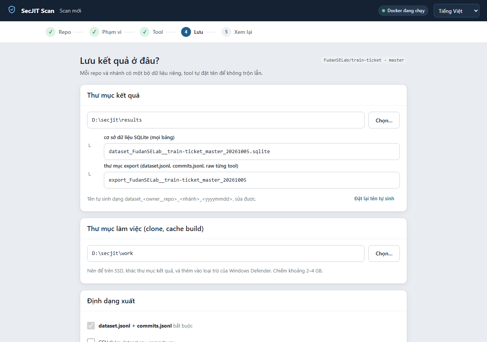

- **Tầng rẻ**: 5 công cụ, mặc định bật hết. Bỏ bớt làm đổi "tập công cụ đủ năng lực" và κ so với cấu hình v1 (ứng dụng
  cảnh báo và ghi vào `run_meta`). Dưới 2 công cụ rẻ → không có nhãn silver từ tầng rẻ.
- **Tầng đắt**: **FindSecBugs + SonarQube** (mặc định). **CodeQL** tắt mặc định: chính xác nhất nhưng 7–20 phút/commit
  và cần RAM Docker ≥ 16 GB. Chỉ chọn 1 công cụ đắt → gần như **không thể có gold** (cần ≥ 2 đắt hoặc 1 đắt + 1 rẻ).
- Cột *Image*: `có` / `thiếu → tải ở Preflight` / `cần build`.
- **Luồng tầng rẻ**: ≈ số nhân CPU (mỗi luồng chạy 5 công cụ song song trên 1 commit). **Luồng tầng đắt**: mặc định 1,
  tối đa theo RAM Docker (mỗi build ~3 GB). SonarQube là một server chung cho cả run → chỉ **một** run dùng tầng đắt
  tại một thời điểm trên máy.
- **Giữ cache Maven** (volume `secjit-m2`): luôn bật, nhanh hơn 3–5 lần từ commit thứ hai.
- **Nâng cao · tham số đồng thuận** — **cấu hình v1, chỉ đọc**: cửa sổ gộp dòng `line_window=3`, gold cần
  `≥ 2 tool đắt` hoặc `1 đắt + 1 rẻ`, silver cần `≥ 2 tool rẻ`, lọc nhiễu `CWE-117`. Các tham số này được *đăng ký
  trước* để kết quả không bị "chỉnh cho đẹp". Muốn đổi phải bật **Chế độ thí nghiệm** kèm **lý do ≥ 10 ký tự**; run
  sẽ gắn cờ `experiment`, xuất sang thư mục có hậu tố `_exp`, **không** được gộp với dữ liệu v1.

### Bước 4 · Nơi lưu

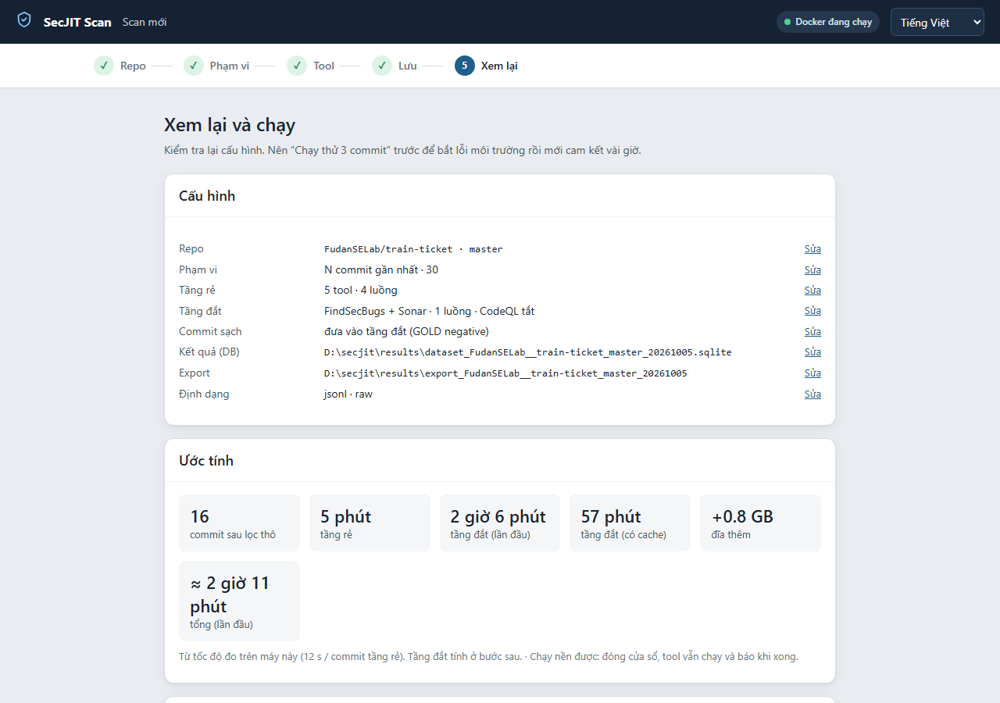

- **Thư mục kết quả** (ví dụ `D:\secjit\results`): chứa **cơ sở dữ liệu SQLite** (mọi bảng) và **thư mục export**
  (`dataset.jsonl`, `commits.jsonl`, raw từng công cụ). Tên tự sinh `dataset_<owner__repo>_<nhánh>_<yyyymmdd>` để không
  trộn lẫn; sửa được. Nếu tên đã tồn tại: chọn **Tiếp tục run cũ** (resume) / **Đổi tên** / **Ghi đè** (hỏi lại khi Chạy).
- **Thư mục làm việc** (clone, cache build): nên trên SSD, **khác** thư mục kết quả, thêm vào loại trừ của Windows
  Defender; chiếm 2–4 GB.
- Tránh thư mục OneDrive/Dropbox (hỏng SQLite), đường dẫn UNC, đường dẫn quá dài (>200 ký tự).
- **Định dạng xuất**: `dataset.jsonl + commits.jsonl` (bắt buộc), thêm CSV (tuỳ chọn); output thô từng công cụ luôn giữ
  để audit (+~60 % dung lượng). Tuỳ chọn thông báo Windows khi xong/lỗi.

### Bước 5 · Xem lại và chạy

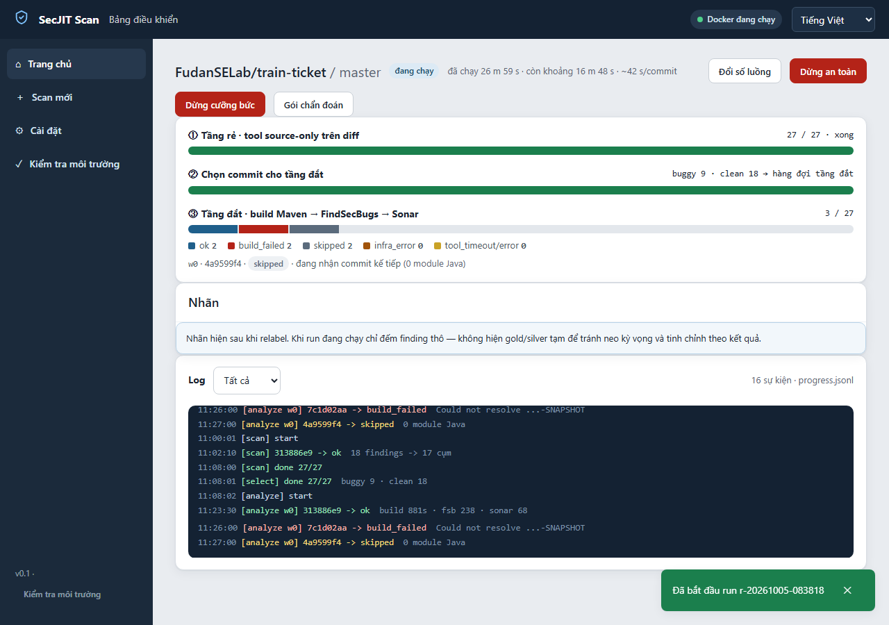

- Bảng **Cấu hình** tóm tắt mọi lựa chọn (mỗi dòng có *Sửa*). Bảng **Ước tính**: commit sau lọc thô, thời gian tầng rẻ,
  tầng đắt lần đầu (cache lạnh) / có cache, đĩa thêm, tổng.
- Nút **Chạy thử 3 commit** — *hãy làm trước* khi cam kết vài giờ: dùng DB tạm (scratch), bắt lỗi môi trường, không
  đụng dữ liệu thật.
- **Chạy**: ứng dụng tạo `profile.json` và khởi động tiến trình nền. **Sao chép lệnh**/**Lưu profile**: lệnh
  PowerShell/bash tương đương để chạy lại trên máy khác (mục 10).

---

## 6. Bảng điều khiển (Dashboard)

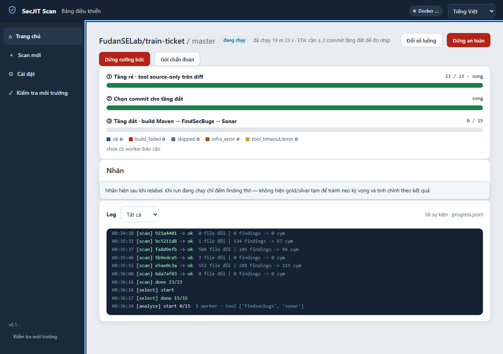

Ba thanh tiến độ, đúng ba pha của pipeline:
1. **Tầng rẻ · tool source-only trên diff** — `đã xong / tổng commit`.
2. **Chọn commit cho tầng đắt** — bao nhiêu commit *buggy* (tầng rẻ có finding) và *clean* đưa vào hàng đợi.
3. **Tầng đắt · build Maven → FindSecBugs → Sonar** — tiến độ kèm phân loại: `ok` · `build_failed` (lỗi dữ liệu: dependency
   mất, compile lỗi) · `skipped` (commit không có module Java — không tính verified-clean) · `infra_error` (Docker/đĩa
   — commit trả về hàng đợi, **không** đếm là dữ liệu; 3 lần liên tiếp run tự dừng) · `tool_timeout/error`.

Dòng dưới cùng: thời gian đã chạy, ước tính còn lại, giây/commit; khung **Log** là `progress.jsonl` (mỗi dòng một sự
kiện). Ô **Nhãn** cố tình **không** hiện gold/silver khi run đang chạy — tránh "neo" kỳ vọng rồi chỉnh theo kết quả.

**Dừng:**
| Nút | Làm gì | Khi nào |
|---|---|---|
| **Dừng an toàn** | đặt cờ dừng; run **xong commit hiện tại** rồi mới dừng, không để dữ liệu nửa chừng; trạng thái `đã dừng`, bấm *Tiếp tục* sau | muốn tạm nghỉ, tắt máy, nhường máy |
| **Dừng cưỡng bức** | kết thúc tiến trình ngay, dọn container/network của **đúng run này** (theo nhãn `orch.run`), commit đang build trả về hàng đợi; phải gõ `DỪNG` để xác nhận | run treo, Docker hỏng |

**Đổi số luồng** áp dụng từ commit kế tiếp. **Gói chẩn đoán**: zip log + cấu hình + thông tin Docker để gửi hỗ trợ.

**Run nền / đóng cửa sổ:** run là tiến trình tách rời. Đóng cửa sổ → hộp thoại *Chạy nền / Dừng / Huỷ*; chọn *Chạy
nền* thì run vẫn chạy, mở lại ứng dụng sẽ thấy ở Trang chủ (nút *Mở bảng điều khiển*). Nếu máy tắt đột ngột, run thành
`bị ngắt` → *Tiếp tục*.

---

## 7. Kết quả

### 7.1 Tổng quan

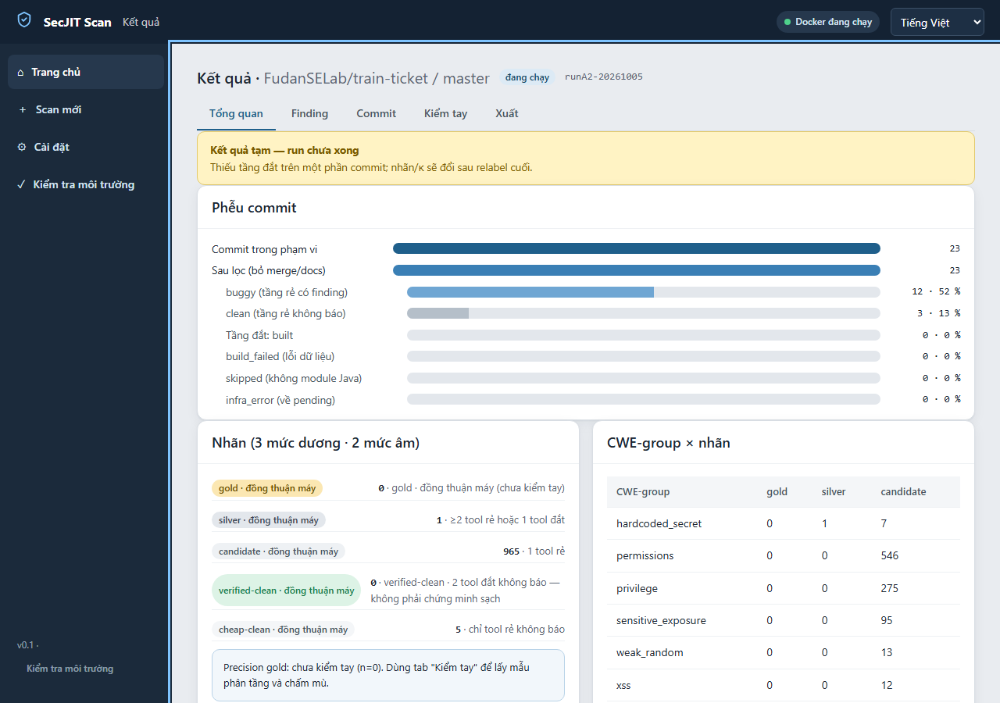

- **Phễu commit**: commit trong phạm vi → sau lọc (bỏ merge/docs) → buggy / clean → tầng đắt: built / build_failed /
  skipped / infra_error. Đọc phễu để biết **tầng đắt phủ được bao nhiêu** (app Spring cũ có thể build_failed rất nhiều
  vì dependency SNAPSHOT biến mất).
- **Nhãn (3 mức dương · 2 mức âm)**: luôn kèm chữ **"đồng thuận máy"** cho tới khi được kiểm tay; số *Precision gold*
  chỉ xuất hiện sau khi có phiên kiểm tay (mục 8).
- **CWE-group × nhãn**: lỗi tập trung ở nhóm nào.
- **κ Fleiss** (độ đồng thuận giữa các công cụ vượt ngẫu nhiên): **κ tổng thường ÂM** (−0,2 … −0,5) trên mọi repo.
  Không phải lỗi: các công cụ phủ **miền CWE rời nhau** (gitleaks chỉ secret, FindSecBugs bytecode, Sonar rule riêng),
  nên phần lớn cụm chỉ 1 công cụ báo. Hãy xem κ **theo nhóm CWE** và **theo cặp công cụ** thay vì κ tổng; κ là tín
  hiệu "các công cụ phủ nhau tới đâu", không phải chất lượng nhãn.
- **Giới hạn**: danh sách câu sinh tự động từ số liệu (tầng đắt phủ bao nhiêu, commit skipped, chưa kiểm tay, κ âm,
  chưa có gold…). **Hãy chép nguyên mục này vào báo cáo** khi trích số.
- Khi run chưa xong, có dải vàng *Kết quả tạm* — nhãn/κ sẽ đổi sau relabel cuối.

### 7.2 Finding + Bằng chứng

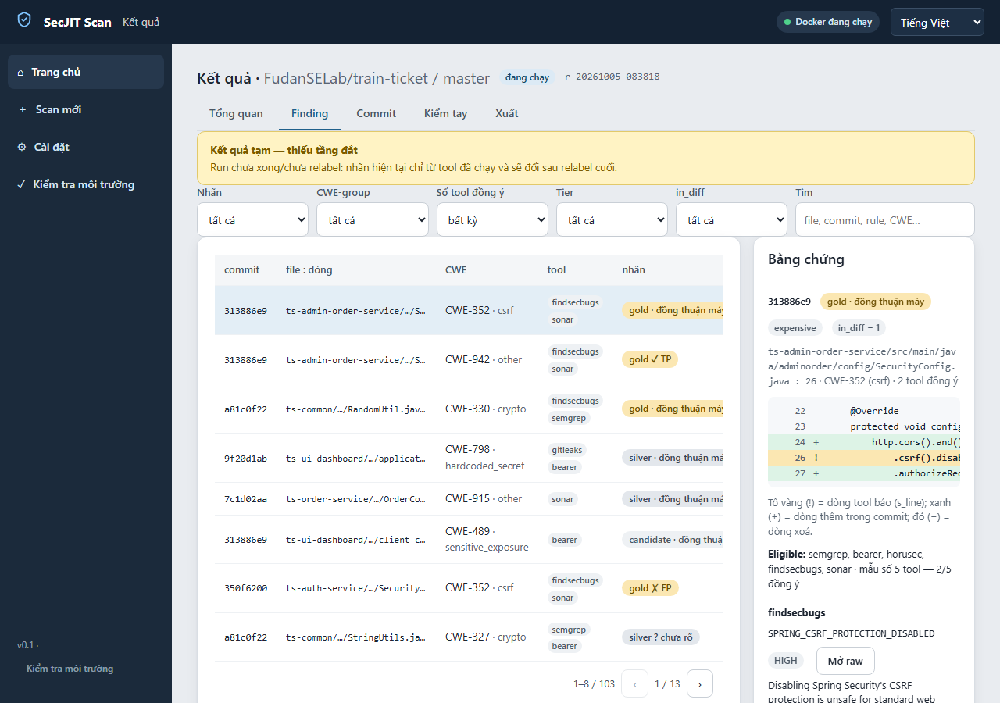

- Bảng mỗi dòng = **một cụm** `(file, nhóm CWE, dòng ± 3)`: commit, file:dòng, CWE/nhóm, công cụ đã báo, nhãn. Bộ lọc:
  nhãn, CWE-group, số công cụ đồng ý, tier (cheap/expensive/mixed), `in_diff`, ô tìm.
- Huy hiệu nhãn: `gold · đồng thuận máy` (chưa kiểm) · `gold ✓ TP` (người kiểm xác nhận đúng) · `gold ✗ FP` (xác nhận
  sai) · `gold ? chưa rõ`.
- Bấm một dòng → khung **Bằng chứng**: diff với dòng công cụ báo (tô vàng `!`), dòng thêm (`+`), dòng xoá (`−`);
  *Eligible* = những công cụ **đủ năng lực** cho loại lỗi này (mẫu số của đồng thuận — không chia cho cả 8 công cụ);
  từng **thông điệp công cụ** với rule id, mức độ, nút **Mở raw** (SARIF/XML/JSON nguyên bản); khối **provenance**:
  run_id, digest từng image Docker, `line_window`, luật gold. Mọi nhãn truy ngược được tới output thô.
- Nếu diff không chứa dòng công cụ báo → `in_diff = 0`: lỗi *có sẵn* trong file, không do commit này.

### 7.3 Commit
Mỗi dòng một commit trong hàng đợi tầng đắt: ngày, vai trò (buggy/clean), trạng thái, **`n_expensive_ok`** (số công cụ
đắt chạy xong), `negative_level` (`verified-clean` chỉ khi `n_expensive_ok ≥ 2`), 14 đặc trưng Kamei (kích thước/
lịch sử commit, dùng cho dự đoán lỗi), và thông báo lỗi build nếu có.

### 7.4 Xuất
- **Xuất** tạo thư mục export: `dataset.jsonl` (1 dòng = 1 cụm, có `cluster_key` và `evidence{consensus, validation}`),
  `commits.jsonl` (1 dòng = 1 commit, có `n_expensive_ok`, `negative_level`), `negatives.json`, thư mục raw từng commit,
  tuỳ chọn CSV/LaTeX bảng thống kê.
- **`run_manifest.json`**: toàn bộ "giấy khai sinh" của run — profile, `run_meta` hai tầng (image + digest từng công cụ,
  mã nguồn orchestrator `orchestrator_git_sha`, phiên bản ứng dụng, Docker, hệ điều hành), κ, số đếm nhãn, danh sách
  commit `build_failed / infra_error / tool_timeout / tool_error / skipped`, tham số v1, cờ thí nghiệm.
- **`SHA256SUMS`**: mã băm của `dataset.jsonl`, `commits.jsonl`, `run_manifest.json` — người nhận kiểm tra file không bị
  sửa. Thư mục đích đã có dữ liệu thì ứng dụng **xuất sang thư mục mới** (`_2`, `_3`…) — không bao giờ ghi đè/trộn.

---

## 8. Kiểm tay GOLD — giao thức mù

Mục đích: biến "gold · đồng thuận máy" thành con số **precision có khoảng tin cậy**. Ba bước trong tab **Kiểm tay**.

### Bước 1 · Tạo mẫu phân tầng
Nhập **seed** (ví dụ 42), số mục dương (`n_pos`, mặc định 200) và số mục âm (`n_neg`, mặc định 100). Ứng dụng lấy mẫu
cụm gold **phân tầng theo nhóm CWE × tier** (mỗi tầng ít nhất 1 mục, tỉ lệ theo số có) và commit verified-clean. Cùng
seed + cùng DB → **cùng mẫu** (tái lập). Chưa có gold/verified-clean → màn báo trống và lý do (cần chạy tầng đắt).

### Bước 2 · Chấm mù

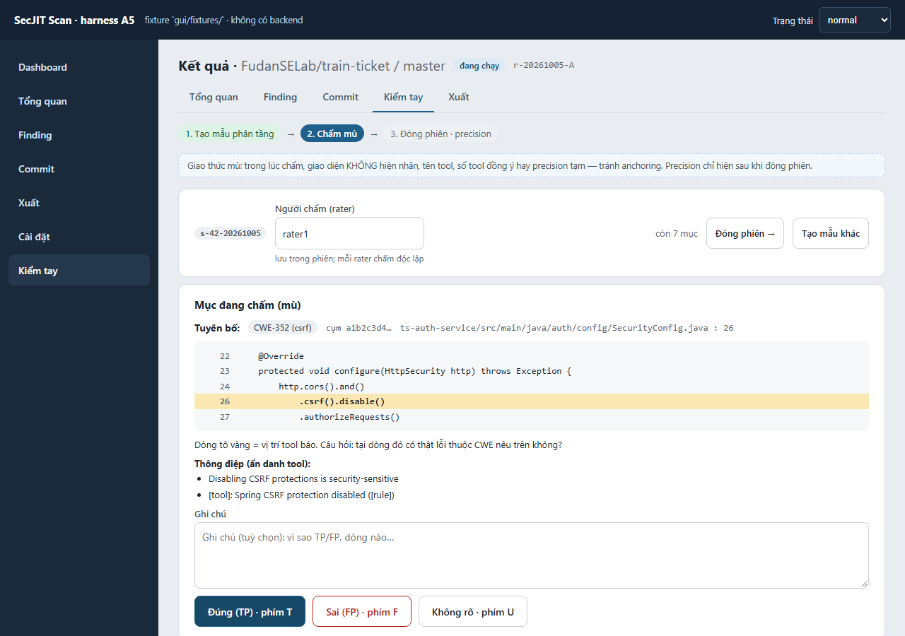

- Nhập tên **người chấm** (rater). Nên có **2 người chấm độc lập**, mỗi người một tên, không trao đổi khi chấm.
- Màn chỉ hiện: **tuyên bố CWE**, file:dòng, code ± 8 dòng với dòng công cụ báo tô vàng, diff, thông điệp **đã ẩn tên
  công cụ/rule**. **Không** hiện nhãn, tên công cụ, số công cụ đồng ý, precision tạm — tránh "mồi" người chấm.
- Câu hỏi duy nhất: *tại dòng đó có thật lỗi thuộc CWE nêu trên không?* → **Đúng (TP) · phím T**, **Sai (FP) · phím F**,
  **Không rõ · phím U**, kèm ghi chú (tuỳ chọn). Với mục âm (commit verified-clean): TP = commit thật sự không đưa lỗi
  mới vào.
- Có thể dừng và quay lại; mỗi rater có hàng đợi riêng ("còn N mục").

### Bước 3 · Đóng phiên

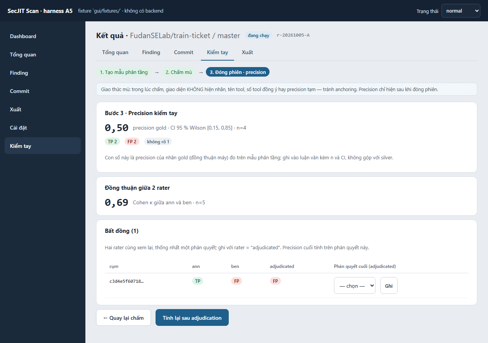

- **Precision gold** = TP / (TP + FP), kèm **khoảng tin cậy Wilson 95 %** và n; `không rõ` báo riêng. Mục âm có precision
  riêng ("thật sự sạch").
- **Cohen κ giữa 2 rater** trên các mục cả hai đã chấm; bảng **Bất đồng** liệt kê mục hai người khác nhau → hai người cùng
  xem lại, chọn phán quyết cuối (rater đặc biệt `adjudicated`) → **Tính lại sau adjudication**. Phán quyết cuối được ưu
  tiên khi xuất `evidence.validation`.
- Khi viết báo cáo: ghi *precision kèm n và CI*, nói rõ số công cụ đồng ý chỉ là tiêu chí chọn, không phải bằng chứng.

---

## 9. Cài đặt & Dọn dẹp

### 9.1 Tab Cài đặt
- **Docker & tài nguyên**: RAM/CPU Docker đọc được, port SonarQube (đổi khi 9000 bận — mặc định đề xuất 9100), RAM cho
  CodeQL, volume cache Maven, đường dẫn `docker.exe` nếu PATH thiếu.
- **Profile**: các cấu hình đã lưu (mỗi profile = một file JSON), nhập/xuất.
- **Chế độ chạy**: thư mục kết quả/làm việc mặc định, thông báo Windows.
- **Ngôn ngữ**: Tiếng Việt / English.

### 9.2 Dọn dẹp (tab Dung lượng)
Mỗi mục có nhãn **An toàn xoá?**:
| Mục | An toàn? | Hậu quả |
|---|---|---|
| Pool clone rác (`work\pool_*`) | **an toàn** | không mất gì (sót lại từ run bị ngắt) |
| Clone repo (`work\<owner__repo>`) | **an toàn** | lần chạy sau clone lại (tốn mạng) |
| Cache Maven (volume `secjit-m2`) | xoá sẽ làm chậm | build lại dependency, chậm 3–5 lần |
| Image Docker | tải/build lại khi dùng | ~6 GB tải lại |
| **Kết quả đã xuất / DB** | **KHÔNG tự xoá** | chỉ *Mở thư mục* để bạn tự quyết |

Luôn có **Xem trước khi xoá** (danh sách đường dẫn + dung lượng) rồi mới xoá; ứng dụng **từ chối** dọn khi có run đang
chạy dùng thư mục đó.

---

## 10. Lệnh tương đương & kiểm tra tái lập

Mọi nút trong GUI chỉ là vỏ của một lệnh dòng lệnh với **cùng profile**. Bản dòng lệnh là `secjit-scan.exe` (hoặc
`python -m orchestrator.cli …` nếu có mã nguồn). Wizard bước 5 có nút **Sao chép lệnh** cho PowerShell/bash.

```powershell
# Chạy trọn pipeline từ profile (y hệt nút Chạy)
secjit-scan.exe --profile D:\secjit\profiles\train-ticket-30.json

# Ước tính thời gian / thống kê / so sánh / kiểm hợp đồng (mọi lệnh có --json)
secjit-scan.exe --cli estimate --profile D:\secjit\profiles\train-ticket-30.json --json
secjit-scan.exe --cli stats    --db D:\secjit\results\dataset_A.sqlite --format md
secjit-scan.exe --cli compare  --a D:\secjit\results\export_A --b D:\secjit\results\export_B --format md
secjit-scan.exe --cli review   --db D:\secjit\results\dataset_A.sqlite sample --seed 42 --n-pos 200 --n-neg 100
secjit-scan.exe --cli sensitivity --db D:\secjit\results\dataset_A.sqlite --out D:\secjit\sens_A   # trên BẢN SAO DB
```
Với mã nguồn: `PYTHONPATH=src python scripts/verify_run.py --db <DB> --export <export>` (kiểm run đúng hợp đồng,
PASS/FAIL từng mục) và `python scripts/results_report.py --a <exportA> --b <exportB> --db-a … --db-b … --out RESULTS.md`
(báo cáo nghiệm thu tái lập A/B).

**Quy trình tái lập "Run A / Run B":**
1. Chạy Run A (GUI hoặc `--profile`). Xuất → có `run_manifest.json` + `SHA256SUMS`.
2. Trang chủ → **Chạy lại cùng profile** → Run B (DB/export tên mới).
3. `compare --a <exportA> --b <exportB>`: khớp = cùng tập cụm theo `cluster_key`; mọi lệch phải nằm trong
   `tool_timeout / infra_error / skipped / build_failed` của manifest (lệch do hạ tầng), nếu không `compare` trả mã lỗi.
4. `verify_run.py` cho từng run; `results_report.py` ra `RESULTS.md` với kết luận ĐẠT/CHƯA ĐẠT và so digest image.

---

## 11. Sự cố thường gặp

| Hiện tượng | Nguyên nhân | Cách xử lý |
|---|---|---|
| Trang chủ hiện **Docker tắt**; Preflight mục *Docker daemon* cam | Docker Desktop chưa chạy | bấm **Bật Docker** (chờ ≤ 90 s) hoặc mở Docker Desktop tay rồi **Kiểm tra lại** |
| Run đang chạy, Dashboard hiện **`infra_error`** liên tiếp rồi tự dừng | Docker bị tắt/khởi động lại giữa chừng, hoặc đĩa đầy | bật lại Docker / giải phóng đĩa → Trang chủ → **Tiếp tục**; các commit đó đã được trả về hàng đợi, không mất dữ liệu, không bị ghi thành `build_failed` |
| Preflight: **Port SonarQube 9000 đang bị dùng** | dịch vụ khác (minio, app web) chiếm 9000 | bấm **Dùng port trống** (9100…) — ghi vào profile; hoặc đổi ở Cài đặt → Docker |
| **Đĩa đầy** (`disk is full`, `No space left`) | clone + cache + kết quả vượt dung lượng | run tự dừng với trạng thái hạ tầng; dọn ở Cài đặt → Dung lượng rồi **Tiếp tục** |
| Log: `[semgrep] … WinError 206 The filename or extension is too long` | lỗi phiên bản cũ khi commit đổi rất nhiều file (dòng lệnh Windows giới hạn 32 k ký tự) | **đã vá**: bản hiện tại chép file vào thư mục tạm rồi quét cả thư mục, không còn phụ thuộc số file. Nếu còn thấy ở run cũ: *Chạy lại từ đầu* với bản mới |
| **"DB đang được run khác dùng"** | một run khác (hoặc run cũ chưa thoát) đang giữ `<db>.lock` | đợi run đó xong hoặc **Dừng** nó ở Trang chủ; nếu tiến trình đã chết, khoá tự được giải phóng khi mở lại (ứng dụng kiểm PID) |
| Nhiều `build_failed` với `Could not resolve … -SNAPSHOT` | commit lịch sử dùng dependency SNAPSHOT đã biến mất khỏi Maven Central | là **lỗi dữ liệu**, được ghi nhận trong phễu/manifest — không phải lỗi công cụ; nhãn commit đó chỉ từ tầng rẻ |
| SonarQube không lên (`max virtual memory areas vm.max_map_count [65530] is too low`) | WSL2 chưa đặt `vm.max_map_count` | Preflight mục tương ứng có nút sửa; hoặc chạy `wsl -d docker-desktop sysctl -w vm.max_map_count=262144` (mất sau khi khởi động lại) |
| **"Kết quả tạm — run chưa xong"** | xem kết quả khi run đang chạy | bình thường; nhãn và κ chốt sau relabel cuối |
| Export vào thư mục đã có → tạo `..._2` | thư mục đích không rỗng | chủ ý: không trộn hai run; dùng thư mục mới nhất |
| Repo private: 401/404 | thiếu PAT hoặc sai quyền | bước 1 tick *Repo private*, dán PAT có quyền `repo` |
| Tầng đắt `skipped` nhiều | commit chỉ đụng file không-Java (yml, docs) | bình thường; commit đó không được tính verified-clean |

Cần hỗ trợ: Dashboard → **Gói chẩn đoán** (zip) + ảnh màn Preflight, gửi kèm `run_manifest.json` của run.
